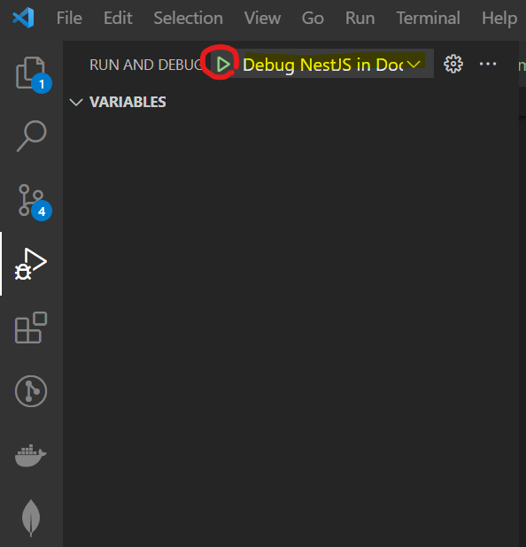

# SECAdvisor
## Preconditions

Install [Docker](https://www.docker.com/)  
Install [Docker Compose](https://docs.docker.com/compose/install/) 

## Production

### Environment

The docker compose `.env` file needs to be overridden in the production mode. Therefore, create a own environment file on your host machine and replace the `HOST_URL` with the one of your host machine. The path of the adapted environment file needs to be passed as argument when you start the docker containers. The code below shows an example how this can be done.

### Usage

To run the application in production mode:

``` sh
# Replace `../config/.env.prod` with the path of your environment file
docker compose --env-file ../config/.env.prod up --build
```

Navigate to `http://localhost` with your browser.

## Development

### Usage

To run the application in dev mode:

``` sh
# Install frontend dependencies
yarn --cwd ./frontend install

# Install public-api dependencies
yarn --cwd ./public-api install
 
# Run containers
docker compose -f docker-compose.dev.yml up --build

# Or run the shell script (is doing the same as the command above)
./run-debug.sh
```

Navigate to `http://localhost` with your browser. Awesome, hot reload for the `public-api` and `frontend` is working!

### Debugging with VS Code

First, run the docker container in dev mode as described above.

#### Public Api

Once the containers are running, attach the debugger and set your breakpoints:

